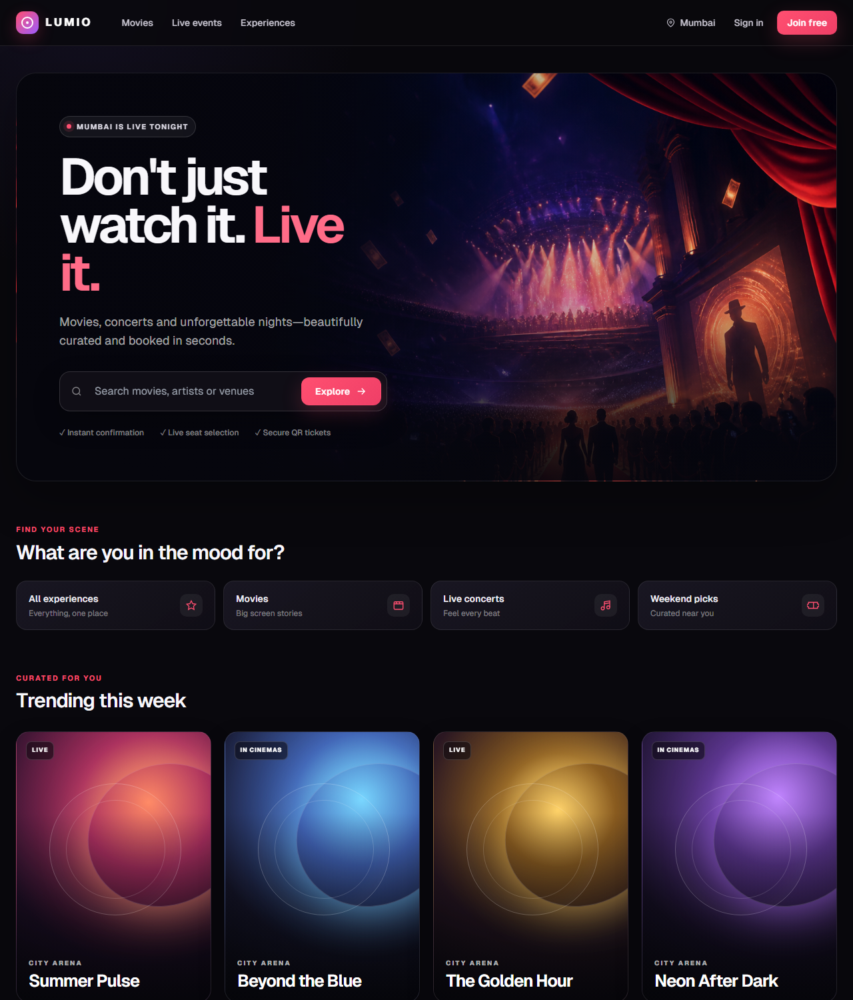
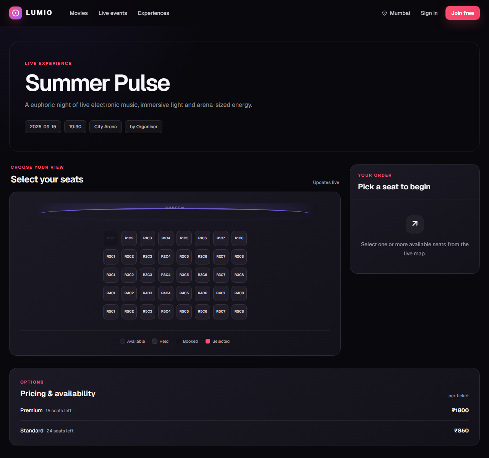
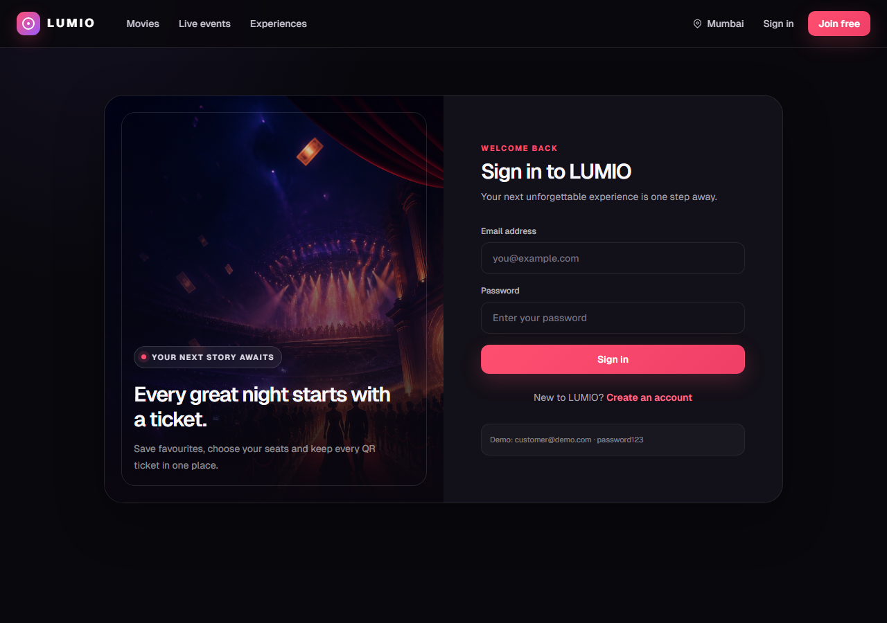
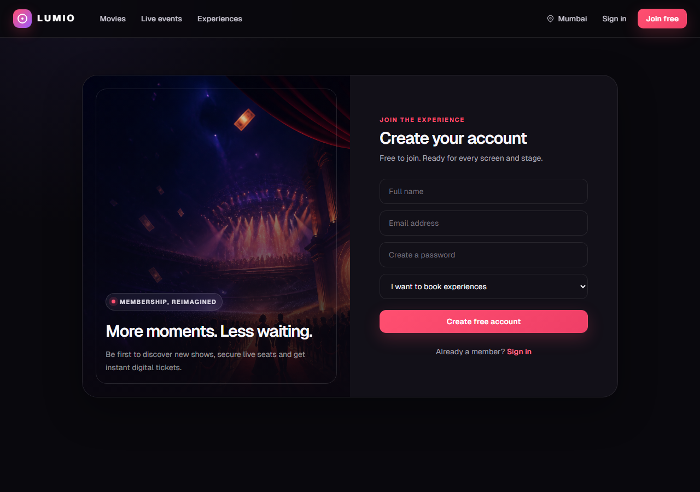
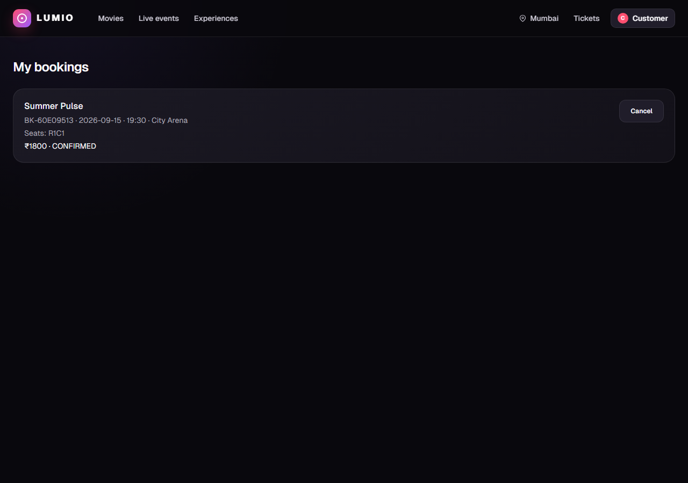
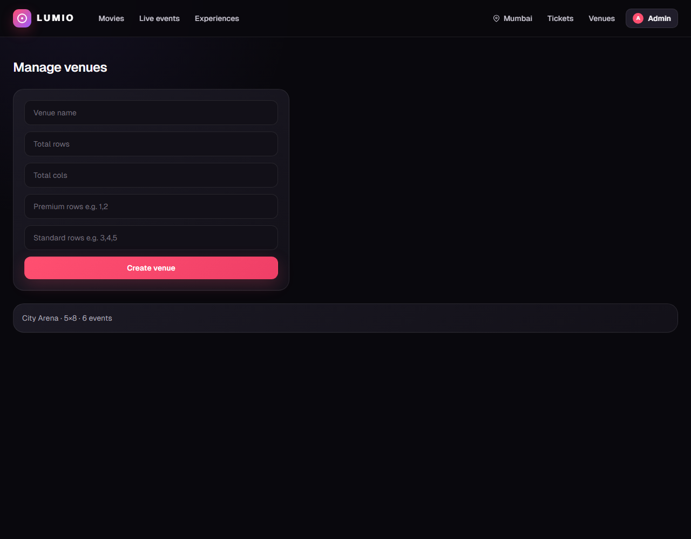
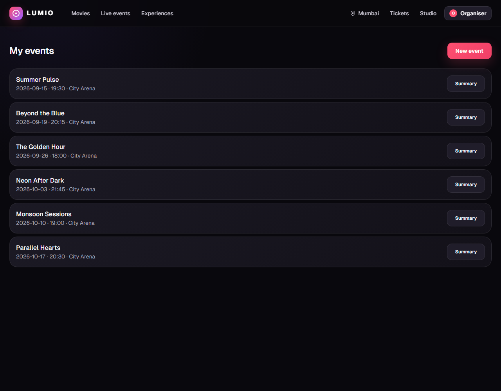
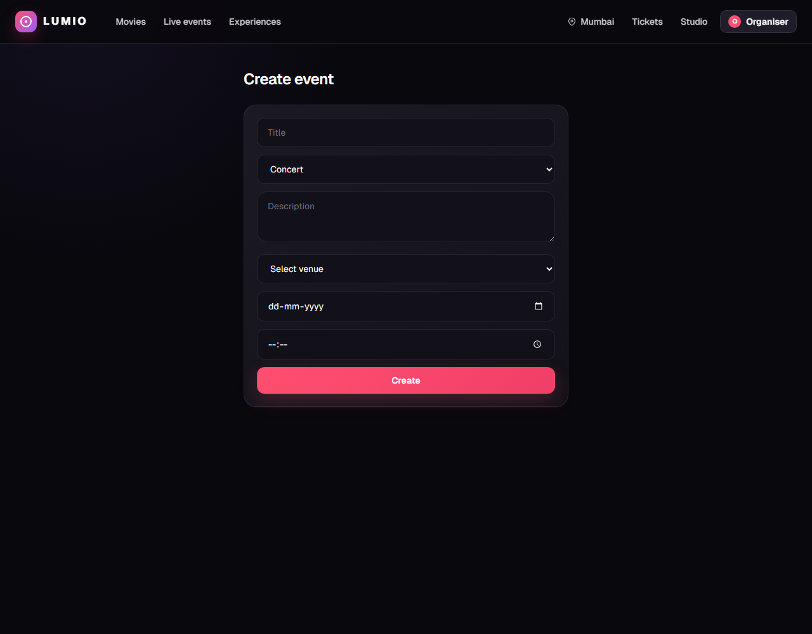
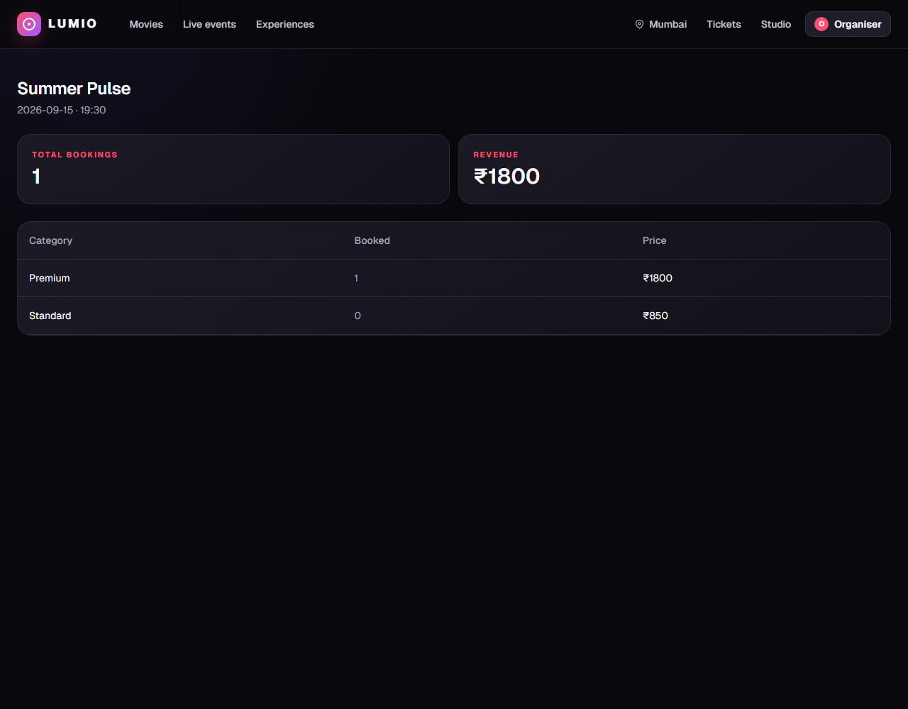

# LUMIO — Ticket Booking Experience

LUMIO is a cinematic movie and live-event booking platform with real-time visual seat maps, timed holds, waitlists, role-based dashboards, and QR email tickets. The interface is original and responsive, with a premium entertainment identity designed for quick discovery and low-friction checkout.

- **Repository:** https://github.com/DEVESH859/ticket-booking_2027
- **Branch:** `main`
- **Stack:** Next.js 14, React, TypeScript, Tailwind CSS, Prisma and SQLite

## Visual product tour

The screenshots below cover every user-facing page in the application. They were captured from the running production build with the included demo data. The booking and revenue examples use one local sample booking so those states are visible.

### 1. Discovery homepage



The homepage is the entertainment discovery hub:

- Cinematic hero with a global search for events, artists and venues.
- Quick filters for movies, concerts and curated experiences.
- Responsive event cards with live/cinema labels, venue details, dates and starting prices.
- Search and category filters query the real events API without a page reload.
- Clear trust cues for instant confirmation, live seat selection and secure QR tickets.

### 2. Event details and live seat booking



The event page combines discovery, inventory and checkout:

- Event description, date, time, venue and organiser context.
- Visual seat map with available, held, booked and selected states.
- Seat inventory refreshes every three seconds so availability stays current.
- Selected seats appear in a sticky order summary with category pricing and final total.
- Ten-minute seat holds protect the customer while they complete checkout.
- Sold-out categories expose the waitlist action automatically.

### 3. Sign in



The sign-in experience includes:

- Premium split-screen presentation with the original LUMIO artwork.
- Email/password authentication backed by signed JWT access tokens.
- Automatic return to the originally requested page after authentication.
- A visible customer demo account for fast evaluator access.

### 4. Create an account



Registration supports both sides of the marketplace:

- Customers can create an account to book and manage tickets.
- Organisers can select the organiser role and publish events.
- Successful registration signs the user in immediately.
- Validation and API errors are displayed inside the form without losing entered context.

### 5. Customer bookings



The customer ticket area provides:

- Booking reference, event schedule, venue, seats, total and current status.
- One place to access every confirmed reservation.
- Cancellation for active bookings.
- Cancellation releases seats and can trigger the next time-limited waitlist offer.

### 6. Admin venue management



The admin workspace controls physical inventory:

- Create a venue by defining its row and column grid.
- Assign premium and standard seat rows during creation.
- Review existing venue capacity and the number of linked events.
- Role protection prevents customers and organisers from accessing admin controls.

### 7. Organiser event dashboard



The organiser dashboard is the publishing command centre:

- Lists only events owned by the signed-in organiser.
- Shows schedule and venue information at a glance.
- Provides direct links to event performance summaries.
- Includes a prominent action for creating a new event.

### 8. Create an event



The event creation workflow captures:

- Event title, movie/concert type and customer-facing description.
- Venue, date and start time.
- Category-specific ticket prices based on the selected venue.
- Automatic creation of live per-event seat inventory after publishing.

### 9. Organiser performance summary



The event summary turns bookings into useful operating information:

- Total confirmed booking count.
- Gross ticket revenue.
- Category-level booked-seat and price breakdown.
- Access restricted to the event organiser and administrators.

## Setup

```bash
npm install
cp .env.example .env
npx prisma migrate deploy
npm run db:seed
npm run dev
```

Open http://localhost:3000

### Demo accounts

| Role | Email | Password |
|------|-------|----------|
| Admin | admin@demo.com | password123 |
| Organiser | organiser@demo.com | password123 |
| Customer | customer@demo.com | password123 |

## Environment variables

Copy `.env.example` to `.env`:

| Variable | Purpose |
|----------|---------|
| `DATABASE_URL` | SQLite path, e.g. `file:./dev.db` |
| `JWT_SECRET` | Signs auth tokens |
| `SEAT_HOLD_TTL_MINUTES` | Checkout hold duration (default 10) |
| `WAITLIST_OFFER_TTL_MINUTES` | Waitlist offer window (default 15) |
| `CRON_SECRET` | Protects `/api/cron/release-holds` |
| `APP_URL` | Base URL for waitlist offer email links |
| `SMTP_HOST/PORT/USER/PASS/FROM` | Optional — emails log to console if unset |

## API reference

| Method | Path | Auth | Description |
|--------|------|------|-------------|
| POST | `/api/auth/register` | — | Register (customer or organiser) |
| POST | `/api/auth/login` | — | Login, returns JWT |
| GET | `/api/auth/me` | Bearer | Current user profile |
| GET | `/api/venues` | — | List venues |
| POST | `/api/venues` | Admin | Create venue with seat layout |
| GET | `/api/events` | — | Browse events (`?type=MOVIE&q=search`) |
| GET | `/api/events?mine=true` | Organiser | List own events only |
| POST | `/api/events` | Organiser | Create event with pricing |
| GET | `/api/events/:id` | — | Event details |
| GET | `/api/events/:id/seats` | — | Seat map + availability |
| POST | `/api/events/:id/seats` | Customer | Hold seats (`seatIds`, optional `offerToken`) |
| POST | `/api/events/:id/book` | Customer | Confirm booking + QR email |
| GET | `/api/events/:id/waitlist` | Customer | My waitlist entries for event |
| POST | `/api/events/:id/waitlist` | Customer | Join category waitlist |
| GET | `/api/events/:id/waitlist/offer?token=` | Optional | Validate waitlist offer |
| GET | `/api/bookings` | Customer | Booking history |
| DELETE | `/api/bookings/:id` | Customer | Cancel booking |
| GET | `/api/organiser/events/:id/summary` | Organiser | Bookings + revenue |
| GET/POST | `/api/cron/release-holds` | `x-cron-secret` or Bearer | Expire holds and offers |

## Database schema

### User
| Field | Type | Notes |
|-------|------|-------|
| id | String | Primary key |
| email | String | Unique |
| password | String | bcrypt hash |
| name | String | Display name |
| role | Enum | ADMIN, ORGANISER, CUSTOMER |

### Venue / SeatCategory / Seat
Venues have a row-by-column grid. Each seat belongs to a category (Premium, Standard) with a colour for the map.

### Event / CategoryPrice
Organisers create events linked to a venue with per-category pricing.

### ShowSeat
Per-event copy of each venue seat with live status: `AVAILABLE`, `HELD`, or `BOOKED`. Holds store `heldUntil`, `heldById`, and a `version` counter for concurrency.

### Booking / BookingSeat
Confirmed bookings have a unique `ref` (used in QR codes), status, total amount, and linked seats.

### WaitlistEntry
Queue per event and category. Fields: `position`, `status` (WAITING/OFFERED/FULFILLED/EXPIRED), `offerToken`, `offerExpiresAt`, `offeredSeatId`.

Full Prisma schema: `prisma/schema.prisma`

## Seat hold logic

1. Customer selects seats on the visual map and clicks **Hold seats**.
2. `POST /seats` sets each seat to `HELD` with `heldUntil = now + TTL`.
3. Other customers see held seats as unavailable (map polls every 3 seconds).
4. Customer reviews details and clicks **Confirm booking**.
5. Expired holds release on seat-map fetch and via cron every minute.
6. Conditional DB updates prevent two customers holding the same seat.

## Waitlist logic

1. Sold-out category: customer joins waitlist queue.
2. On cancellation: seat held for next waiter, email with time-limited link.
3. Customer books via offer link with token validation.
4. Expired offers cascade to the next person automatically.

## Assignment deliverables

| Item | Location |
|------|----------|
| Source code | GitHub repo (branch `main`) |
| Setup guide + API docs + DB schema | This README |
| Environment template | `.env.example` |
| System design (800 words max) | `SYSTEM_DESIGN.md` |
| Hosted URL | Deploy section below |

## Deploy

**Railway (recommended):** persistent SQLite, import repo, set env vars, build `npm run build && npm run db:deploy`, start `npm start`. Schedule cron to hit `/api/cron/release-holds` every minute.

**Vercel:** `vercel.json` includes cron. Set `CRON_SECRET` in env. SQLite is ephemeral on Vercel — use Railway for a persistent demo.

## Hosted URL

Add your live deployment URL after publishing:

`https://your-app.up.railway.app`
